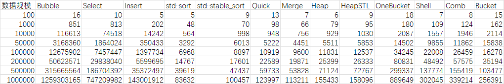
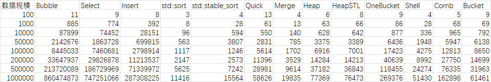
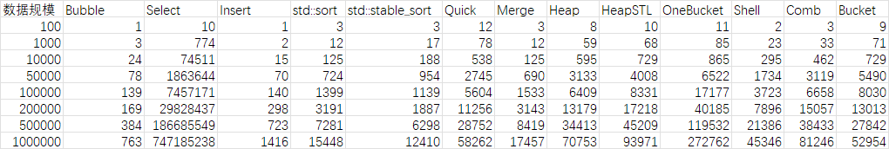
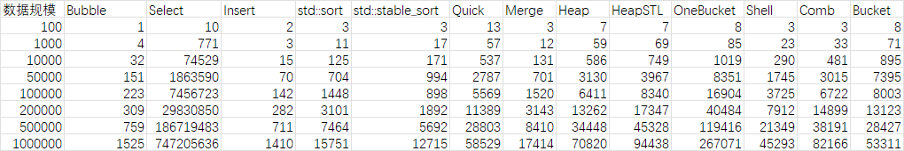
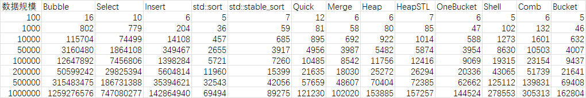

# 第3章《排序算法》实验报告

21051117 卢俊成

## 基本信息

- 尽可能实现最优化的状态。
- 尽可能按 template sort 进行代码实现

## 完成算法

- O(n²)
  - 冒泡排序
    - 双向冒泡（鸡尾酒）
    - 提前停止优化
  - 选择排序
    - 双向选择
  - 插入排序
- O(nlogn)
  - `std::sort()`
  - 快速排序
    - 随机哨兵
    - 栈替换递归
  - 归并排序
    - 迭代优化
  - 堆排序
  - 堆排序 (玩笑版)
    - `std::priority_queue` 实现
- O(n)
  - 一位桶排序
    - `std::map` 实现
- 其他
  - 希尔排序
    - 斐波那契数列
  - 梳排序
    - 步进倍率 0.9
  - 桶排序
    - 桶数量 不大于 2^16 允许主动退化到一元桶
    - 内联 希尔排序

## 测试数据集

100、1 000、10 000、50 000、100 000、200 000、500 000、1 000 000 个 `int`

1. 随机数 (重复三次，取平均)
2. 倒序
3. 正序
4. 准正序
5. 窄带随机数据 (单一数字平均出现次数不小于 10lgn - 10)

## 测试环境信息

CPU: Intel Xeon(Skylake) Platinum 8163 / Intel Xeon(Cascade Lake) Platinum 8269CY 2.5 GHz/2.7 GHz  
阿里云 ECS 华东1(杭州) 可用区G ecs.c5.large 2 vCPU 4 GiB  
Ubuntu 20.04.4 LTS (GNU/Linux 5.4.0-107-generic x86_64)

```bash
LemonBench Server Test Tookit 20201005 Intl BetaVersion (C)iLemonrain. All Rights Reserved.
==========================================================================================
 
 [Info] Bench Start Time: 2022-04-07 14:24:34
 [Info] Test Mode: CPU Performance Test Only (Standard Mode)
 

 -> CPU Performance Test (Standard Mode, 3-Pass @ 30sec)

 1 Thread Test: 		895 Scores
 2 Threads Test: 		1492 Scores

==========================================================================================
 
 [Info] Bench Finish Time: 2022-04-07 14:27:35
 [Info] Time Elapsed: 181 seconds
```

```bash
root@SerTest:/dev/shm# g++ -v
Using built-in specs.
COLLECT_GCC=g++
COLLECT_LTO_WRAPPER=/usr/lib/gcc/x86_64-linux-gnu/9/lto-wrapper
OFFLOAD_TARGET_NAMES=nvptx-none:hsa
OFFLOAD_TARGET_DEFAULT=1
Target: x86_64-linux-gnu
Configured with: ../src/configure -v --with-pkgversion='Ubuntu 9.4.0-1ubuntu1~20.04.1' --with-bugurl=file:///usr/share/doc/gcc-9/README.Bugs --enable-languages=c,ada,c++,go,brig,d,fortran,objc,obj-c++,gm2 --prefix=/usr --with-gcc-major-version-only --program-suffix=-9 --program-prefix=x86_64-linux-gnu- --enable-shared --enable-linker-build-id --libexecdir=/usr/lib --without-included-gettext --enable-threads=posix --libdir=/usr/lib --enable-nls --enable-clocale=gnu --enable-libstdcxx-debug --enable-libstdcxx-time=yes --with-default-libstdcxx-abi=new --enable-gnu-unique-object --disable-vtable-verify --enable-plugin --enable-default-pie --with-system-zlib --with-target-system-zlib=auto --enable-objc-gc=auto --enable-multiarch --disable-werror --with-arch-32=i686 --with-abi=m64 --with-multilib-list=m32,m64,mx32 --enable-multilib --with-tune=generic --enable-offload-targets=nvptx-none=/build/gcc-9-Av3uEd/gcc-9-9.4.0/debian/tmp-nvptx/usr,hsa --without-cuda-driver --enable-checking=release --build=x86_64-linux-gnu --host=x86_64-linux-gnu --target=x86_64-linux-gnu
Thread model: posix
gcc version 9.4.0 (Ubuntu 9.4.0-1ubuntu1~20.04.1) 
root@SerTest:/dev/shm# ulimit -a
core file size          (blocks, -c) 0
data seg size           (kbytes, -d) unlimited
scheduling priority             (-e) 0
file size               (blocks, -f) unlimited
pending signals                 (-i) 15496
max locked memory       (kbytes, -l) 65536
max memory size         (kbytes, -m) unlimited
open files                      (-n) 65535
pipe size            (512 bytes, -p) 8
POSIX message queues     (bytes, -q) 819200
real-time priority              (-r) 0
stack size              (kbytes, -s) 8192
cpu time               (seconds, -t) unlimited
max user processes              (-u) 15496
virtual memory          (kbytes, -v) unlimited
file locks                      (-x) unlimited
```

## 编译信息

由于存在 STL 的使用，使用了 O2 优化  
~~吸氧~~

```bash
/usr/bin/g++ -std=c++2a -fdiagnostics-color=always -Wfatal-errors -Wall -Wextra -g -O2 1.cpp -o 1 -lm
```

## 测试结果

```bash
root@SerTest:/dev/shm# date && time ./1 && date
Fri 08 Apr 2022 08:46:30 PM CST
100-Randn1: 180 Finished
100-Randn2: 147 Finished
100-Randn3: 139 Finished
100-Inverse: 107 Finished
100-Preface: 92 Finished
100-About-Preface: 103 Finished
100-Narrowband: 116 Finished
1000-Randn1: 2965 Finished
1000-Randn2: 2960 Finished
1000-Randn3: 2884 Finished
1000-Inverse: 2560 Finished
1000-Preface: 1252 Finished
1000-About-Preface: 1234 Finished
1000-Narrowband: 2549 Finished
10000-Randn1: 218275 Finished
10000-Randn2: 218721 Finished
10000-Randn3: 218440 Finished
10000-Inverse: 196168 Finished
10000-Preface: 79238 Finished
10000-About-Preface: 79604 Finished
10000-Narrowband: 213263 Finished
50000-Randn1: 5450984 Finished
50000-Randn2: 5485668 Finished
50000-Randn3: 5461369 Finished
50000-Inverse: 4741730 Finished
50000-Preface: 1893139 Finished
50000-About-Preface: 1896820 Finished
50000-Narrowband: 5428874 Finished
100000-Randn1: 21660574 Finished
100000-Randn2: 21709687 Finished
100000-Randn3: 21706710 Finished
100000-Inverse: 18771967 Finished
100000-Preface: 7517895 Finished
100000-About-Preface: 7517079 Finished
100000-Narrowband: 21621806 Finished
200000-Randn1: 86295443 Finished
200000-Randn2: 86451269 Finished
200000-Randn3: 86492833 Finished
200000-Inverse: 74829945 Finished
200000-Preface: 29956016 Finished
200000-About-Preface: 29959101 Finished
200000-Narrowband: 86288278 Finished
500000-Randn1: 538889457 Finished
500000-Randn2: 538730931 Finished
500000-Randn3: 538755563 Finished
500000-Inverse: 472170548 Finished
500000-Preface: 187027465 Finished
500000-About-Preface: 187062024 Finished
500000-Narrowband: 538339658 Finished
1000000-Randn1: 2151318556 Finished
1000000-Randn2: 2152123304 Finished
1000000-Randn3: 2152726788 Finished
1000000-Inverse: 1895847987 Finished
1000000-Preface: 747916233 Finished
1000000-About-Preface: 747935102 Finished
1000000-Narrowband: 2150826810 Finished

real    260m33.436s
user    260m31.855s
sys     0m0.200s
Sat 09 Apr 2022 01:07:03 AM CST
```

```text
Clocks per second: 1000000
Data	Bubble	Select	Insert	std::sort	std::stable_sort	Quick	Merge	Heap	HeapSTL	OneBucket	Shell	Comb	Bucket
100-Randn1	18	10	5	6	13	14	8	7	11	27	8	9	16
100-Randn2	16	11	5	6	7	13	7	6	8	15	8	8	15
100-Randn3	15	10	5	5	7	13	7	6	8	14	7	8	14
100-Inverse	11	9	8	3	4	13	4	6	8	9	4	5	9
100-Preface	1	10	1	3	3	12	3	8	10	11	2	3	9
100-About-Preface	1	10	2	3	3	13	3	7	7	8	3	3	8
100-Narrowband	16	10	6	5	7	12	6	6	7	6	5	6	5
1000-Randn1	849	822	219	48	63	97	64	77	89	203	111	125	165
1000-Randn2	859	816	218	48	75	105	64	78	89	171	111	126	164
1000-Randn3	847	803	171	48	74	92	72	84	108	166	107	121	157
1000-Inverse	885	774	392	8	28	61	13	63	66	86	28	68	69
1000-Preface	3	774	2	12	17	78	12	59	68	85	23	33	71
1000-About-Preface	4	771	3	11	17	57	12	59	69	85	23	33	71
1000-Narrowband	802	779	204	36	59	81	58	80	85	47	102	132	46
10000-Randn1	116522	74526	14244	566	673	952	760	930	1075	2253	1545	1926	2098
10000-Randn2	116815	74515	14209	564	1174	950	760	935	1006	2063	1560	1921	2090
10000-Randn3	116503	74514	14273	563	1148	942	748	924	1010	1945	1567	1991	2156
10000-Inverse	87899	74452	28151	96	594	550	140	628	642	877	336	965	792
10000-Preface	24	74511	15	125	188	538	125	595	729	865	295	462	729
10000-About-Preface	32	74529	15	125	171	537	131	586	749	1019	290	481	895
10000-Narrowband	115704	74499	14108	457	685	895	692	922	1014	588	1273	1601	632
50000-Randn1	3154213	1863967	350030	3295	3927	5233	4594	5504	5963	15689	9885	11940	15837
50000-Randn2	3186516	1864058	351560	3230	7053	5241	4387	5522	5807	13977	9844	11855	15887
50000-Randn3	3164352	1864048	349711	3353	7059	5194	4374	5509	5790	13840	9836	11791	15790
50000-Inverse	2142676	1863728	699815	563	3807	2831	785	3375	3389	6436	1948	5947	6138
50000-Preface	78	1863644	70	724	954	2745	690	3133	4008	6522	1734	3119	5490
50000-About-Preface	151	1863590	70	704	994	2787	701	3130	3967	8351	1745	3015	7395
50000-Narrowband	3160480	1864108	349467	2655	3917	4956	3987	5482	5874	3954	8630	10503	4007
100000-Randn1	12648396	7455986	1392263	6902	8462	10918	9798	11800	12771	35808	22027	26434	17332
100000-Randn2	12687729	7458058	1403225	7025	9936	10922	9558	11818	12333	33480	22100	26464	15643
100000-Randn3	12691583	7458297	1397716	6977	8294	10917	9446	11875	12509	33449	21898	26480	15859
100000-Inverse	8445033	7460681	2798914	1117	1246	5614	1702	6916	7001	17423	4275	12813	8650
100000-Preface	139	7457171	140	1399	1139	5604	1533	6409	8331	17177	3723	6658	8030
100000-About-Preface	223	7456723	142	1448	898	5569	1520	6411	8340	16904	3725	6722	8003
100000-Narrowband	12647892	7456806	1398284	5721	7260	10485	8542	11756	12416	9069	19315	23154	9437
200000-Randn1	50504146	29841288	5595165	14790	17676	22548	19849	25391	26364	82396	48582	57882	35772
200000-Randn2	50654406	29844243	5604773	14826	17529	22611	19851	25393	26350	79505	48203	57386	33160
200000-Randn3	50712163	29828591	5599147	14685	17600	22609	19915	25415	26285	80594	48692	57459	36652
200000-Inverse	33647937	29826878	11213537	2147	2573	11396	3529	14284	14213	40639	8992	27750	14699
200000-Preface	169	29828437	298	3191	1887	11256	3143	13179	17218	40185	7896	15057	13013
200000-About-Preface	309	29830850	282	3101	1892	11389	3143	13262	17347	40484	7912	14899	13123
200000-Narrowband	50599242	29825394	5604814	11960	15399	21635	18030	25272	26294	20336	43065	51739	21641
500000-Randn1	315786510	186699387	35348620	39591	47553	59442	53664	71045	72714	305875	137792	155523	101904
500000-Randn2	315645238	186691137	35348107	39511	47464	59689	54135	71165	72818	291285	137300	155459	108940
500000-Randn3	315564945	186722653	35420766	39755	47295	60070	53687	71163	72771	300853	138231	155277	99589
500000-Inverse	213720089	186729969	71339972	5625	7242	28981	9614	37182	36843	118455	24274	76335	31963
500000-Preface	384	186685549	723	7281	6298	28752	8419	34413	45209	119532	21386	38433	27842
500000-About-Preface	759	186719483	711	7464	5692	28803	8410	34448	45328	119416	21349	38191	28427
500000-Narrowband	315483475	186731388	35394621	32543	42056	57659	48607	70404	72385	62662	125112	139831	69408
1000000-Randn1	1258486126	747178203	143054941	84030	100914	124034	113497	155494	158066	934037	302368	338010	268398
1000000-Randn2	1259492644	747231905	142913924	83644	100220	123828	113085	155354	157848	844992	300598	339351	247537
1000000-Randn3	1259930725	747219838	143036873	83223	100238	124129	113053	155451	158376	889919	303170	340281	253239
1000000-Inverse	860474873	747251066	287308225	11416	15564	58626	19835	77369	76473	269376	51430	162898	61461
1000000-Preface	763	747185238	1416	15448	12410	58262	17457	70753	93971	272762	45346	81246	52954
1000000-About-Preface	1525	747205636	1410	15751	12715	58529	17414	70820	94438	267071	45293	82166	53311
1000000-Narrowband	1259276576	747080277	142864940	69494	89275	121230	102020	153885	157257	144524	278553	305313	162804
```

## 整理后的数据及分析



随机数据（重复三次，平均）：基本可以看出 `std::sort` 和 `std::stable_sort` 的表现相对较好。 `BubbleSort`冒泡排序 性能最差。

其中 `BubbleSort`冒泡排序、`SelectSort`选择排序 和 `InsertSort`插入排序 基本为同阶，后续的时间增长基本来自他们。  
（在 1 000 000 的数据规模下，完成一次冒泡就需要20分钟了）



逆序数据中，`InsertSort`插入排序 耗时明显增加，其他有部分算法耗时稍有减少。




在 有序 与 基本有序 两种数据中，`BubbleSort`冒泡排序 和 `InsertSort`插入排序 有明显的时间减少。这种情况对几乎所有的算法都是达到最优状态。



重复数据较多，`BucketSort`桶排序 性能有所提升。


## 源代码

```cpp
#include <cstdio>
#include <cstdlib>
#include <ctime>
#include <cmath>
#include <iterator>
#include <algorithm>
#include <stack>
#include <queue>
#include <map>
#include <cstring>

template <typename T>
inline void swap(T& a, T& b) {
    T t = a;a = b;b = t;
}

template <typename T>
inline void BubbleSort(T begin, T end) {
    int n = end - begin;
    int left = 0, right = n - 1;
    int flag;
    while (left < right) {
        flag = 1;
        for (int i = left; i < right; i++) {
            if (begin[i] > begin[i + 1]) {
                swap(begin[i], begin[i + 1]);
                flag = 0;
            }
        }
        if (flag) break;
        right--;
        flag = 1;
        for (int i = right; i > left; i--) {
            if (begin[i] < begin[i - 1]) {
                swap(begin[i], begin[i - 1]);
                flag = 0;
            }
        }
        if (flag) break;
        left++;
    }
}

template <typename T>
inline void SelectSort(T begin, T end) {
    int n = end - begin;
    int left = 0, right = n - 1;
    while (left < right) {
        int min = right;
        int max = right;
        for (int i = left; i < right; i++) {
            if (begin[i] > begin[max]) max = i;
            if (begin[i] < begin[min]) min = i;
        }
        swap(begin[min], begin[left]);
        if (max == left) max = min;
        swap(begin[max], begin[right]);
        left++;
        right--;
    }
}

template <typename T>
inline void InsertSort(T begin, T end) {
    int n = end - begin;
    for (int i = 1; i < n; i++) {
        int j = i - 1;
        typename std::iterator_traits<T>::value_type key = begin[i];
        while (j >= 0 && begin[j] > key) {
            begin[j + 1] = begin[j];
            j--;
        }
        begin[j + 1] = key;
    }
}

template <typename T>
inline void QuickSort(T begin, T end) {
    std::stack<std::pair<T, T>> s;
    s.push(std::make_pair(begin, end));
    srand(time(NULL));
    while (!s.empty()) {
        begin = s.top().first;
        end = s.top().second;
        s.pop();
        if (begin >= end) continue;
        T left = begin;
        T right = end - 1;
        swap(begin[rand() % (end - begin)], begin[0]);
        typename std::iterator_traits<T>::value_type key = *begin;
        while (left < right) {
            while (left < right && *right >= key) right--;
            if (left < right) *left++ = *right;
            while (left < right && *left <= key) left++;
            if (left < right) *right-- = *left;
        }
        *left = key;
        s.push(std::make_pair(left + 1, end));
        s.push(std::make_pair(begin, left));
    }
}

template <typename T>
inline void MergeSort(T begin, T end) {
    int len = end - begin;
    T a = begin;
    T b = new typename std::iterator_traits<T>::value_type[len];
    int seg, start;
    for (seg = 1; seg < len; seg <<= 1) {
        for (start = 0; start < len; start += 2 * seg) {
            int left = start;
            int mid = std::min(start + seg, len);
            int right = std::min(start + 2 * seg, len);
            int pos = left;
            int s1 = left, e1 = mid;
            int s2 = mid, e2 = right;
            while (s1 < e1 && s2 < e2)
                b[pos++] = a[s1] < a[s2] ? a[s1++] : a[s2++];
            while (s1 < e1) b[pos++] = a[s1++];
            while (s2 < e2) b[pos++] = a[s2++];
        }
        T tmp = a;
        a = b;
        b = tmp;
    }
    if (a != begin) {
        for (int i = 0; i < len; i++)
            begin[i] = a[i];
        b = a;
    }
    delete[ ] b;
}

template <typename T>
inline void HeapSort(T begin, T end) {
    int len = end - begin;
    for (int i = len / 2 - 1; i >= 0; i--) {
        int j = i;
        while (j * 2 + 1 < len) {
            int k = j * 2 + 1;
            if (k + 1 < len && begin[k] < begin[k + 1]) k++;
            if (begin[j] < begin[k]) {
                swap(begin[j], begin[k]);
                j = k;
            } else break;
        }
    }
    for (int i = len - 1; i > 0; i--) {
        swap(begin[0], begin[i]);
        int j = 0;
        while (j * 2 + 1 < i) {
            int k = j * 2 + 1;
            if (k + 1 < i && begin[k] < begin[k + 1]) k++;
            if (begin[j] < begin[k]) {
                swap(begin[j], begin[k]);
                j = k;
            } else break;
        }
    }
}

template <typename T>
inline void HeapSortSimple(T begin, T end) {
    std::priority_queue<typename std::iterator_traits<T>::value_type> q;
    for (T i = begin; i < end; i++)
        q.push(*i);
    for (T i = end - 1; i >= begin; i--) {
        *i = q.top();
        q.pop();
    }
}

template <typename T>
inline void OneBucketSort(T begin, T end) {
    std::map<typename std::iterator_traits<T>::value_type, int> m;
    for (T i = begin; i < end; i++)
        m[*i]++;
    int pos = 0;
    for (auto i = m.begin(); i != m.end(); i++) {
        for (int j = 0; j < i->second; j++)
            begin[pos++] = i->first;
    }
}

template <typename T>
inline void ShellSort(T begin, T end) {
    int len = end - begin;
    int pos = 2;
    std::vector<int> gap;
    gap.push_back(1);
    gap.push_back(2);
    while (gap[pos - 1] < len) {
        gap.push_back(gap[pos - 1] + gap[pos - 2]);
        pos++;
    }
    pos -= 2;
    gap.pop_back();
    while (pos >= 0) {
        for (int i = gap[pos]; i < len; i++) {
            typename std::iterator_traits<T>::value_type key = begin[i];
            int j = i - gap[pos];
            while (j >= 0 && begin[j] > key) {
                begin[j + gap[pos]] = begin[j];
                j -= gap[pos];
            }
            begin[j + gap[pos]] = key;
        }
        pos--;
        gap.pop_back();
    }
}

template <typename T>
inline void CombSort(T begin, T end) {
    double shrink_factor = 0.9;
    int len = end - begin;
    int gap = int(len * shrink_factor);
    while (gap) {
        bool swapped = false;
        for (int i = 0; i < len - gap; i++) {
            if (begin[i] > begin[i + gap]) {
                swap(begin[i], begin[i + gap]);
                swapped = true;
            }
        }
        if (!swapped)
            gap = int(gap * shrink_factor);
    }
}

template <typename T>
inline void BucketSort(T begin, T end) {
    int len = end - begin;
    if (len < 1 << 16) {
        OneBucketSort(begin, end);
        return;
    }
    typename std::iterator_traits<T>::value_type max = *begin, min = *begin;
    for (T i = begin + 1; i < end; i++) {
        if (*i > max) max = *i;
        if (*i < min) min = *i;
    }
    if (max - min < 1 << 16) {
        OneBucketSort(begin, end);
        return;
    }
    std::vector<typename std::iterator_traits<T>::value_type>* bucket = new std::vector<typename std::iterator_traits<T>::value_type>[1 << 16];
    for (T i = begin; i < end; i++)
        bucket[(*i - min) >> 16].push_back(*i);
    for (int i = 0; i < 1 << 16; i++)
        ShellSort(bucket[i].begin(), bucket[i].end());
    int pos = 0;
    for (int i = 0; i < 1 << 16; i++) {
        for (typename std::vector<typename std::iterator_traits<T>::value_type>::iterator j = bucket[i].begin(); j != bucket[i].end(); j++)
            begin[pos++] = *j;
    }
    delete[ ] bucket;
}

inline void generate_source(int type, int number, int* arr) {
    if (type == 0 || type == 1 || type == 2) {
        srand(time(NULL));
        for (int i = 0; i < number; i++)
            arr[i] = rand();
    }
    if (type == 3) {
        for (int i = 0; i < number; i++)
            arr[i] = number - i;
    }
    if (type == 4 || type == 5) {
        for (int i = 0; i < number; i++)
            arr[i] = i;
    }
    if (type == 5) {
        srand(time(NULL));
        int rex = rand() % int(5 * log10(number));
        for (int i = 0; i < rex; i++) {
            int pos = rand() % (number - 1);
            swap(arr[pos], arr[pos + 1]);
        }
    }
    if (type == 6) {
        srand(time(NULL));
        int base = rand();
        int bandwise = number / int(10 * log10(number) - 10);
        for (int i = 0; i < number; i++)
            arr[i] = base + rand() % bandwise;
    }
}

int main() {
    freopen("1.out", "w", stdout);
    int test_num[ ] = { 100, 1000, 10000, 50000, 100000, 200000, 500000, 1000000 };
    const char* test_data_type[ ] = { "Randn1", "Randn2", "Randn3", "Inverse", "Preface", "About-Preface", "Narrowband" };
    printf("Clocks per second: %ld\n", CLOCKS_PER_SEC);
    printf("Data\tBubble\tSelect\tInsert\tstd::sort\tstd::stable_sort\tQuick\tMerge\tHeap\tHeapSTL\tOneBucket\tShell\tComb\tBucket\n");
    int* source = new int[test_num[sizeof(test_num) / sizeof(int) - 1]];
    int* sort = new int[test_num[sizeof(test_num) / sizeof(int) - 1]];
    for (unsigned long int i = 0; i < sizeof(test_num) / sizeof(int); i++) {
        int n = test_num[i];
        time_t t_begin, t_end;
        time_t tt_begin, tt_end;
        for (unsigned long int j = 0; j < sizeof(test_data_type) / sizeof(char*); j++) {
            fprintf(stderr, "%d-%s: ", n, test_data_type[j]);
            tt_begin = clock();

            printf("%d-%s\t", n, test_data_type[j]);
            generate_source(j, n, source);

            memcpy(sort, source, sizeof(int) * n);
            t_begin = clock();
            BubbleSort(sort, sort + n);
            t_end = clock();
            printf("%ld\t", t_end - t_begin);

            memcpy(sort, source, sizeof(int) * n);
            t_begin = clock();
            SelectSort(sort, sort + n);
            t_end = clock();
            printf("%ld\t", t_end - t_begin);

            memcpy(sort, source, sizeof(int) * n);
            t_begin = clock();
            InsertSort(sort, sort + n);
            t_end = clock();
            printf("%ld\t", t_end - t_begin);

            memcpy(sort, source, sizeof(int) * n);
            t_begin = clock();
            std::sort(sort, sort + n);
            t_end = clock();
            printf("%ld\t", t_end - t_begin);

            memcpy(sort, source, sizeof(int) * n);
            t_begin = clock();
            std::stable_sort(sort, sort + n);
            t_end = clock();
            printf("%ld\t", t_end - t_begin);

            memcpy(sort, source, sizeof(int) * n);
            t_begin = clock();
            QuickSort(sort, sort + n);
            t_end = clock();
            printf("%ld\t", t_end - t_begin);

            memcpy(sort, source, sizeof(int) * n);
            t_begin = clock();
            MergeSort(sort, sort + n);
            t_end = clock();
            printf("%ld\t", t_end - t_begin);

            memcpy(sort, source, sizeof(int) * n);
            t_begin = clock();
            HeapSort(sort, sort + n);
            t_end = clock();
            printf("%ld\t", t_end - t_begin);

            memcpy(sort, source, sizeof(int) * n);
            t_begin = clock();
            HeapSortSimple(sort, sort + n);
            t_end = clock();
            printf("%ld\t", t_end - t_begin);

            memcpy(sort, source, sizeof(int) * n);
            t_begin = clock();
            OneBucketSort(sort, sort + n);
            t_end = clock();
            printf("%ld\t", t_end - t_begin);

            memcpy(sort, source, sizeof(int) * n);
            t_begin = clock();
            ShellSort(sort, sort + n);
            t_end = clock();
            printf("%ld\t", t_end - t_begin);

            memcpy(sort, source, sizeof(int) * n);
            t_begin = clock();
            CombSort(sort, sort + n);
            t_end = clock();
            printf("%ld\t", t_end - t_begin);

            memcpy(sort, source, sizeof(int) * n);
            t_begin = clock();
            BucketSort(sort, sort + n);
            t_end = clock();
            printf("%ld\n", t_end - t_begin);

            tt_end = clock();
            fprintf(stderr, "%ld Finished\n", tt_end - tt_begin);
        }
    }
    fclose(stdout);
    return 0;
}
```
